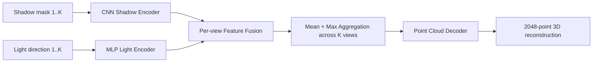

# Shadow2Points

**End-to-End 3D Reconstruction from Multi-Illumination Shadow Observations**

> Model implementation for the research project **Shadow2Points**, accepted at **CVAA 2026**.

Shadow2Points studies whether 3D object geometry can be reconstructed from a set of 2D shadow observations captured under multiple known illumination directions. The current repository contains the PyTorch baseline used to encode shadow images and light directions, fuse multi-illumination evidence, and decode the fused representation into a 3D point cloud.

Companion synthetic-data pipeline: **[rtx_lidar_dataset](https://github.com/Jony-do-ai/rtx_lidar_dataset)**

---

## Overview

Given a sequence of shadow masks and the corresponding illumination directions, the model predicts a 3D point cloud representing the underlying object geometry.

**Input**
- `K` shadow masks, currently configured as **10** observations per object
- one known 3D illumination direction for each shadow observation

**Output**
- a reconstructed point cloud with **2048 points** by default

The current implementation is a data-driven baseline. It is intentionally simple and modular so that future work can investigate physics-informed and model-based extensions that explicitly incorporate the known relationship among illumination, geometry, ray propagation, and shadow formation.

---

## Method



The baseline consists of four main components:

1. **Shadow image encoder**  
   Each single-channel shadow mask is encoded by a convolutional network into an image feature vector.

2. **Illumination encoder**  
   The corresponding 3D light direction is encoded by an MLP.

3. **Multi-illumination fusion**  
   Image and illumination features are concatenated and fused per observation. Features from all illumination directions are then aggregated with mean and max pooling.

4. **Point-cloud decoder**  
   The global feature is decoded into a fixed-size 3D point cloud.

Training is driven primarily by **Chamfer Distance** between the predicted and ground-truth point clouds. Optional center and bounding-box regularization terms are also implemented and can be enabled through the configuration file.

---

## Repository Structure

```text
shadow3d-recon/
├── configs/
│   └── train_default.yaml        # training and model configuration
├── scripts/
│   ├── train.py                  # training entry point
│   └── infer.py                  # inference entry point
├── src/shadow3d/
│   ├── datasets/                 # shadow-sequence dataset loader
│   ├── losses/                   # Chamfer and auxiliary losses
│   ├── models/                   # Shadow2Points baseline model
│   └── utils/                    # dataset utilities
├── requirements.txt
└── README.md
```

---

## Data Format

The training loader expects each object instance to contain multiple shadow observations together with illumination metadata and a ground-truth point cloud.

A typical sample follows this structure:

```text
data/train_runs/dataset/
└── <category_id>/
    └── <instance_id>/
        ├── frame_000/
        │   ├── shadow_mask.png
        │   └── light_info.txt
        ├── frame_001/
        │   ├── shadow_mask.png
        │   └── light_info.txt
        ├── ...
        ├── frame_009/
        │   ├── shadow_mask.png
        │   └── light_info.txt
        └── object_geometry/
            └── gt.ply
```

`light_info.txt` stores the illumination orientation as `theta` and `phi`. During loading, the angles are converted into a normalized 3D light-direction vector.

Ground-truth point clouds are centered, normalized to a unit sphere, and sampled/padded to the configured number of points.

Synthetic shadow observations and synchronized ground-truth geometry are generated with the companion Isaac Sim pipeline:

**[Jony-do-ai/rtx_lidar_dataset](https://github.com/Jony-do-ai/rtx_lidar_dataset)**

> Note: the two repositories currently use slightly different intermediate directory layouts. Before training, organize generated sequences into the structure expected by `ShadowSequenceDataset`. A future cleanup will provide a single end-to-end conversion command.

---

## Installation

Clone the repository and install the Python dependencies:

```bash
git clone https://github.com/Jony-do-ai/shadow3d-recon.git
cd shadow3d-recon
pip install -r requirements.txt
```

The current training script also uses Open3D to save point-cloud previews:

```bash
pip install open3d
```

A CUDA-capable PyTorch environment is recommended for training.

---

## Configuration

The default experiment is defined in:

```text
configs/train_default.yaml
```

Current defaults include:

| Setting | Default |
|---|---:|
| Shadow observations per object | 10 |
| Shadow resolution | 256 × 256 |
| Image feature dimension | 256 |
| Light feature dimension | 128 |
| Fused feature dimension | 256 |
| Output points | 2048 |
| Optimizer | Adam |
| Learning rate | 1e-3 |
| Epochs | 100 |
| Primary loss | Chamfer Distance |

Edit the YAML file to change data paths, model size, optimization settings, or loss weights.

---

## Training

From the repository root:

```bash
python scripts/train.py --config configs/train_default.yaml
```

Training saves:
- `latest.pt`
- `best.pt`
- periodic checkpoints
- predicted and ground-truth `.ply` point-cloud previews
- a copy of the experiment configuration

under the output directory defined in the YAML configuration.

---

## Inference

Run inference on the configured test set:

```bash
python scripts/infer.py \
  --config configs/train_default.yaml \
  --checkpoint data/train_runs/shadow_point_baseline/checkpoints/best.pt \
  --all
```

For each sample, inference writes:

```text
outputs/infer/<sequence>/
├── pred.ply
├── gt.ply
└── meta.json
```

To evaluate a single sample, omit `--all` and specify `--index`.

---

## Train/Test Split Utility

Preview the dataset split operation without moving files:

```bash
python src/shadow3d/utils/split_train_test.py --dry_run
```

Apply the split:

```bash
python src/shadow3d/utils/split_train_test.py
```

---

## Research Motivation and Current Limitations

The current model learns an end-to-end statistical mapping from multi-illumination shadows to 3D geometry. This baseline demonstrates the feasibility of the task, but it also exposes several open research questions:

- **Generalization to unseen geometry** remains challenging.
- The network currently learns the shadow-to-geometry relationship mostly from data rather than explicitly enforcing the known shadow-formation process.
- The current experiments use a fixed number of illumination observations and a synthetic-data setting.
- The point-cloud decoder predicts a fixed number of points and does not explicitly model surface topology.

A key direction for future work is to incorporate a **differentiable shadow/image-formation model** into training so that a predicted 3D geometry must reproduce the observed shadows under the known illumination conditions. The goal is to investigate whether explicit physical consistency can improve reconstruction robustness and out-of-distribution generalization.

---

## Related Repository

### Synthetic Multi-Illumination Dataset Generation

**[rtx_lidar_dataset](https://github.com/Jony-do-ai/rtx_lidar_dataset)**

The companion repository uses NVIDIA Isaac Sim and ShapeNet-derived assets to generate synchronized:

- multi-illumination RGB renders,
- shadow masks,
- illumination metadata,
- and ground-truth 3D point clouds.

---

## Paper

**Shadow2Points: End-to-End 3D Reconstruction from Multi-illumination Shadow Observations**  
CVAA 2026 — **Accepted**

The final citation and paper link will be added after publication of the proceedings.

---

## Project Status

This repository is a research codebase associated with an academic project. The current release focuses on reproducibility of the baseline model and is being cleaned up for easier external use.
